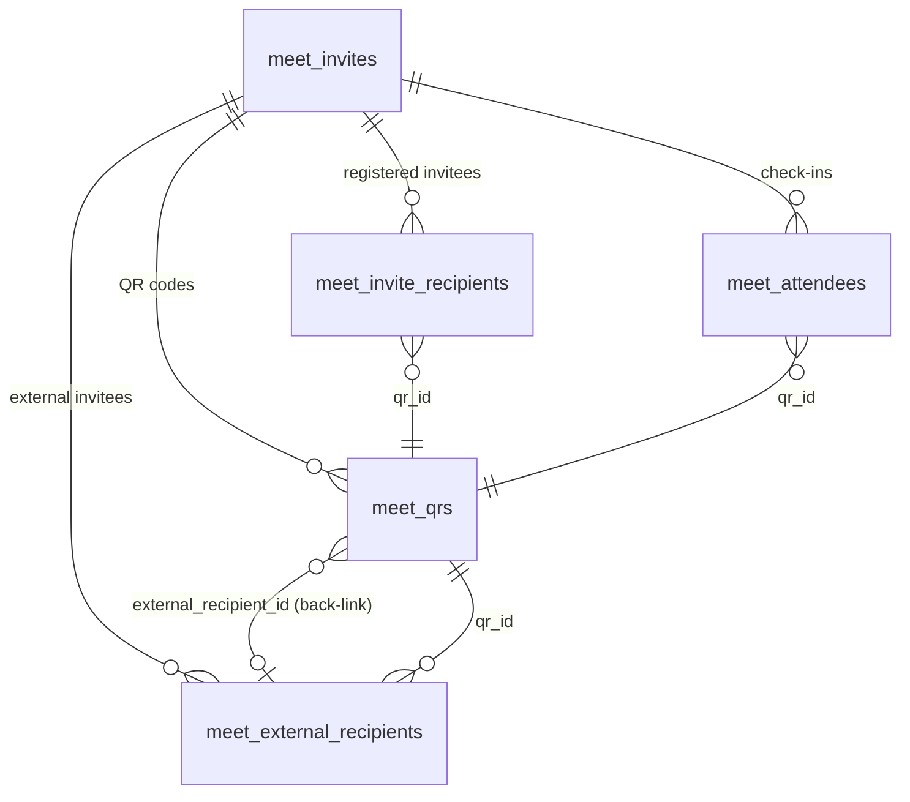
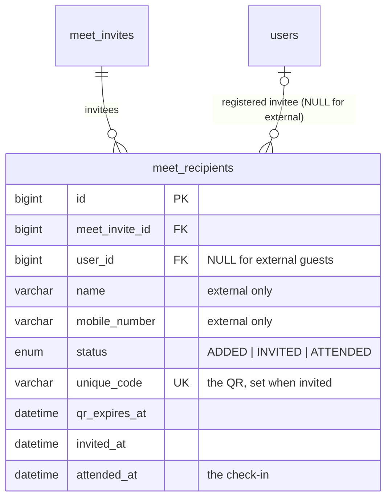

# From 183,000 rows to 860: fixing a hanging API by redesigning its schema

A case study from a production **NestJS + Sequelize + MySQL** backend: a B2B loyalty platform where field sales officers organise in-person events ("meets"), invite people, send them a QR code on WhatsApp and scan that QR at the door to check them in.

One endpoint, the meet detail screen, stopped responding for large meets. Fixing it properly meant redesigning four tables into one and migrating live data without losing a single invitation or check-in.

> Code and numbers are from the real project, with client names, hostnames and personal data removed.

---

## TL;DR

|                                             | Before                            | After                          |
| ------------------------------------------- | --------------------------------- | ------------------------------ |
| Rows returned to load one large meet        | **~183,000**                      | **~860**                       |
| Tables describing "one invitee"             | 4                                 | 1                              |
| Database writes per check-in                | 3 tables                          | 1 conditional `UPDATE`         |
| Users' sensitive fields in the API response | password hash, national ID fields | id, name, role only            |
| Rollback path                               | —                                 | tested end to end, re-runnable |

---

## 1. The symptom

`GET /sales-officer/meets/:id` never returned for some meets. The client just showed _"Waiting to receive a response from your server (3 minutes so far)"_. Worse, the Node process didn't recover: memory and swap filled up, every other endpoint stopped responding, and the process couldn't even be force-killed.

## 2. The root cause: a Cartesian product hidden by the ORM

The detail query loaded a meet with all of its related lists in **one** Sequelize `findOne`:

```ts
this.meetInviteModel.findOne({
  where: { id: meetId, salesOfficerId },
  include: [
    { association: "recipients", include: ["user", "qr"] },
    { association: "externalRecipients" },
    { association: "qrs", include: ["user"] },
    { association: "attendees", include: ["user", "qr"] },
  ],
});
```

Each of those is a **one-to-many** relation from the meet. When an ORM turns several one-to-many includes into a single SQL query with `LEFT JOIN`s, the row counts **multiply**, they don't add:

```
rows = recipients × external_recipients × qrs × attendees
     ≈ 427 × 1 × 428 × 1
     ≈ 183,000 rows   (each carrying full user and QR columns)
```

The database returned that quickly. The expensive part was Sequelize de-duplicating 183k wide rows back into nested objects in JavaScript, which blocked the event loop and exhausted memory.

**How it was found:** the ngrok request inspector showed which call hung. Reading the generated query and running `COUNT(*)` on each related table for the failing meet made the multiplication obvious.

## 3. The quick fix (hotfix)

Sequelize can load each one-to-many list in its own query:

```ts
{ association: 'recipients', separate: true, include: ['user', 'qr'] },
{ association: 'qrs',        separate: true, include: ['user'] },
// ...
```

That turns ~183k rows into ~860 rows across a few small queries. It's safe to ship immediately, but it only treats the symptom.

## 4. The real problem: four tables for one concept

Looking closer, four tables each stored part of _"one person invited to one meet"_:



- **Two recipient tables with identical columns.** Registered and external invitees behaved the same; only where the name and phone came from differed.
- **The QR was linked in both directions.** The recipient pointed at the QR and the QR pointed back at the recipient, so the two could disagree.
- **`meet_attendees` repeated `status = ATTENDED`.** One check-in wrote to three tables (insert an attendee, update the QR, update the recipient).
- **The API leaked data.** Because whole `users` rows were included, the response contained every user column, including password hashes and national ID fields.

## 5. The redesign

One row per invitee. That row **is** the invitation, the QR code and the check-in:



Design decisions:

- **Derive state, don't store it.** The QR's `USED` / `EXPIRED` status is computed from `status` and `qr_expires_at`, so it can never drift out of sync:
  ```ts
  if (!r.uniqueCode) return null;
  if (r.status === ATTENDED) return USED;
  if (r.qrExpiresAt < now) return EXPIRED;
  return ACTIVE;
  ```
- **Let constraints enforce the rules.** Unique keys on `(meet_invite_id, user_id)`, `(meet_invite_id, mobile_number)` and `unique_code`. MySQL allows repeated `NULL`s in a unique index, so the first constraint only applies to registered invitees and the second only to external ones.
- **Make check-in race-proof.** Instead of read-then-write across three tables, a single conditional update:
  ```sql
  UPDATE meet_recipients
  SET status = 'ATTENDED', attended_at = ?
  WHERE id = ? AND status <> 'ATTENDED';
  -- 0 affected rows → someone already checked in; two simultaneous scans can't both succeed
  ```
- **Select only what the screen shows.** The user include is limited to `id, firstName, lastName, role`.
- **Keep the API shape compatible.** The response keeps its existing fields (`recipients`, `qrs`, `attendees`), now built from the same rows, so the mobile app didn't need a release.

Result: **5 tables → 2**, and the detail page is **2 indexed queries**.

## 6. Migrating live data safely

This was the hard part. The rule: **the migration must be able to fail without leaving damage, and be undone after it succeeds.**

### 6.1 Audit the real data first

Before writing the migration, read-only queries checked the assumptions the code relied on. On the development database they didn't hold:

| Finding                                                                                                                  | Count                 | Decision                                                                                            |
| ------------------------------------------------------------------------------------------------------------------------ | --------------------- | --------------------------------------------------------------------------------------------------- |
| QR codes with **no recipient row** (left behind by an old invite bug), yet already sent on WhatsApp and used to check in | 179 QRs / 85 invitees | Recreate the missing recipient rows                                                                 |
| Several such QRs for the same person in the same meet                                                                    | 94 extra              | Keep the used one, else the one sent on WhatsApp, else the newest; the rest were never sent or used |
| Check-ins saved under the **wrong meet**                                                                                 | 12                    | Take attendance from the QR's own recipient, which moves them to the correct meet                   |

Production had none of those, but had a different one that dev's foreign keys made impossible: **a recipient pointing at a user that no longer existed** (production's old table never enforced that foreign key). That's covered in 6.4.

### 6.2 Copy, verify, then change

```
1. CREATE TABLE meet_recipients
2. BEGIN
     INSERT … registered recipients (+ their QR)
     INSERT … external recipients (+ their QR)
     INSERT … recovered rows from orphan QRs (ROW_NUMBER() to pick one per person)
     VERIFY  (any failure → ROLLBACK + DROP TABLE, database unchanged)
   COMMIT
3. Re-link whatsapp_messages → meet_recipient_id, rewrite dedup keys, VERIFY
4. RENAME old tables → legacy_*        (not DROP)
```

The checks run inside the transaction, before anything destructive:

- Row counts match per source table.
- Every QR that was **used, sent on WhatsApp or checked in with** exists on a new row.
- Every old check-in is now an `ATTENDED` row.
- Every WhatsApp message links to the recipient holding **the same QR code it was sent with**.

**A MySQL detail that mattered:** DDL statements like `CREATE TABLE` commit on their own and can't be rolled back. So on failure the migration drops the half-built table itself, leaving the database exactly as it was.

**A side effect that mattered:** WhatsApp messages were de-duplicated by a key derived from the old IDs. Without rewriting those keys to the new IDs, every invite already sent would have looked new and been **sent again**.

### 6.3 Make it reversible

- Old tables are **renamed** to `legacy_*`, not dropped, and each new row keeps `legacy_*_id` columns pointing back at its source rows.
- The `down` migration restores the old tables, the WhatsApp columns and the original dedup keys.
- Every `down` step checks the current state first (table exists? column exists?), so a rollback that stops halfway can **simply be run again**. This was learned the hard way: the first rollback test on dev stopped on a foreign key name longer than MySQL's 64-character limit.
- Rollback was **tested on dev and compared field by field** against a JSON backup taken just before the migration: 5 tables, 0 differences. The migration was then re-applied.
- Dropping the `legacy_*` tables is a **separate, deferred migration**, kept outside the migrations folder so `db:migrate` can't run it by accident, and run only after production has been checked for a few days. It's the only step that can't be undone.

### 6.4 It failed in production, and that was fine

The first production run stopped on:

```
ERROR: Cannot add or update a child row: a foreign key constraint fails
(meet_recipients ... FOREIGN KEY (user_id) REFERENCES users (id))
```

One recipient row pointed at a user that no longer existed. Because the copy ran in a transaction and the migration cleaned up its own table, **production was left exactly as before**. The old code kept serving traffic. The fix was to skip recipients whose user no longer exists (they can't receive or use an invite), keep them in `legacy_*`, report the count, and still fail verification if any skipped row had ever been used or sent.

## 7. Release process

1. Snapshot the database.
2. Run a read-only audit script against production data and review it.
3. Run the migrations, then deploy the new code straight away. The additive migrations are safe for the old code; the breaking one runs right before the deploy, at a low-traffic time.
4. Run a read-only verify script (missing QRs, unmatched check-ins, unlinked messages: all must be 0).
5. Smoke-test: a large meet's details, check-in, sending invites.
6. Days later, run the deferred migration that drops `legacy_*`.

## 8. Lessons

- **ORMs hide the SQL.** Several one-to-many `include`s in one query is a Cartesian product waiting for enough data. Read the generated query.
- **Indexes wouldn't have helped.** The problem was the shape of the result, not how fast rows were found.
- **Audit production data, not just dev.** Each environment had problems the other didn't.
- **Design migrations to fail safely first.** Verify before anything destructive, keep the old data, and test the rollback, not just the migration.
- **Prefer derived state and database constraints** to state kept in sync by application code.
- **Check which environment you're pointed at before running anything.** A shared `.env` file switched to production is all it takes to run dev tooling against live data.

## 9. If I did it again

For zero downtime, I'd use **expand and contract**: add the new table, have the code write to both, backfill, switch reads, then drop the old tables. That's more releases and more code, so it's worth it when even a short window of broken screens isn't acceptable.

---

**Stack:** NestJS · TypeScript · Sequelize (sequelize-typescript) · MySQL 8 · sequelize-cli migrations · BullMQ (WhatsApp queue) · Jest
